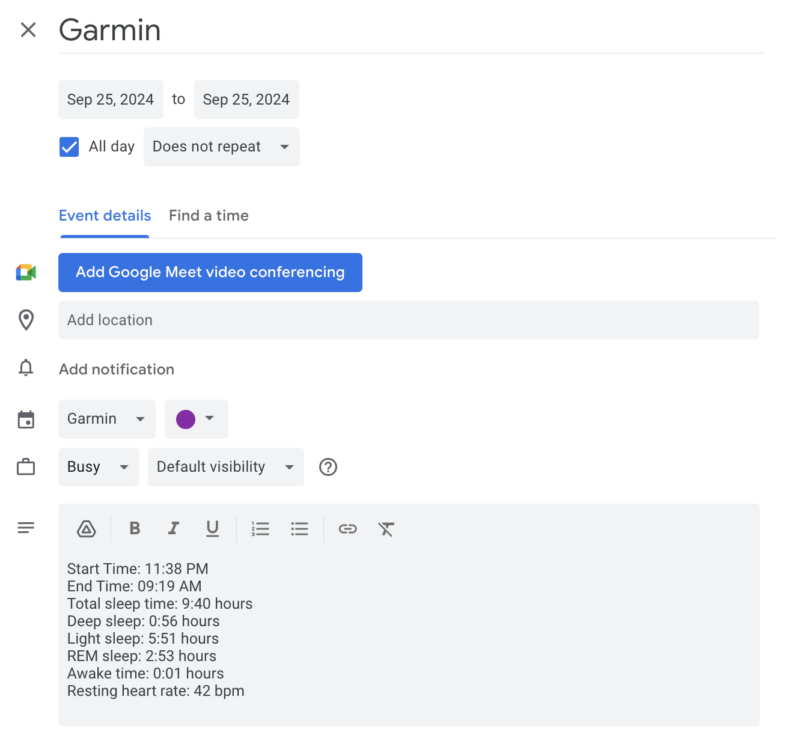

### GCal Garmin Integration

This repository implements a simple way to transfer daily Garmin statistics to Google Calendar events.



The script `add_sleep_event.py` adds the sleep data pulled from the Garmin API for the current day. It can also be run with an argument of the form `MM-DD-YYYY` to create an event for any given day.

Script is configured to only add sleep data, but a full list of API endpoints from the garminconnect library can be found [here](https://github.com/cyberjunky/python-garminconnect).

### Configuring

Create a `Google Cloud` project and add the `Google Calendar API`. Create a service account for the project, copy its email, and create new credentials in `Keys -> Add Key -> JSON`.

Go to `Google Calendar -> Settings -> Add calendar -> Create new calendar`, then navigate to `Settings and Sharing` for that calendar and share the calendar with the email of the service account, and give it `Make Changes to Events` permissions.

Clone this repository, then install packages in your desired environment.

```
pip3 install -r requirements.txt
```

Create a `.env` file structured as follows, with your Garmin credentials, the ID of the calendar you created (found in calendar settings) and the path to your credentials file.

```
EMAIL='email'
PASSWORD='password'
CALENDAR_ID='calendar-id'
CREDENTIALS_FILE='path/to/credentials.json'
```

You can schedule this script to run as a cron-job or through some other means to create events daily.

### References

[python-garminconnect](https://github.com/cyberjunky/python-garminconnect)
[Google Calendar API](https://developers.google.com/calendar/api/v3/reference?apix=true)
